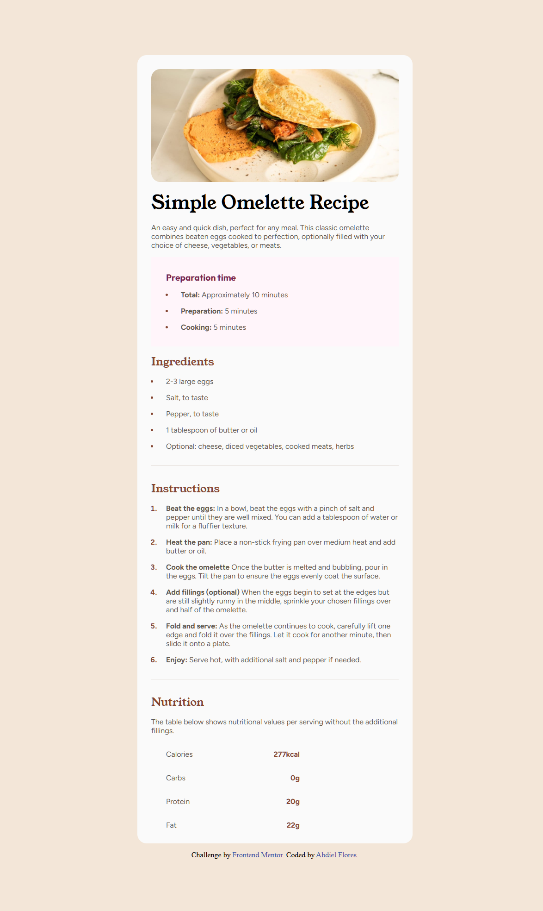

# Frontend Mentor - QR code component solution

This is a solution to the [QR code component challenge on Frontend Mentor](https://www.frontendmentor.io/challenges/qr-code-component-iux_sIO_H). Frontend Mentor challenges help you improve your coding skills by building realistic projects.

## Table of contents

- [Overview](#overview)
  - [Screenshot](#screenshot)
  - [Links](#links)
- [My process](#my-process)
  - [Built with](#built-with)
  - [What I learned](#what-i-learned)
  - [Continued development](#continued-development)
  - [Useful resources](#useful-resources)
- [Author](#author)
- [Acknowledgments](#acknowledgments)

**Note: Delete this note and update the table of contents based on what sections you keep.**

## Overview

### Screenshot



### Links

- Solution URL: [Add solution URL here](https://github.com/fm-challenges-abdiel/recipe-page)
- Live Site URL: [Add live site URL here](https://fm-challenges-abdiel.github.io/recipe-page/)

## My process

- Structure HTML with semantic tags
- Structure CSS with desktop first approach
- Adjust paddings and sizes
- Using flex properties to proportionally expand
- Use a single media query to make it responsive for mobile.

### Built with

- HTML5
- CSS3
- Flexbox

### What I learned

I've been struggling with an issue this time, and it was the <main> tag or container class. This bug or issue makes my container to not have a radious, but there is a simple way to fix it,
use the next code:

```CSS
.container {
  overflow: hidden;
}
```

### Continued development

This practice help me to realize some gaps that I have in my skills and its actually helping me to learn how to approach them. I will continue my frontend mentor paths!

### Useful resources

- [CSS Tricks Overflow Topic](https://css-tricks.com/preventing-child-background-overflow-with-inherited-border-radii/), this page help me when I was struggling with my container.

## Author

- Website - [Foxcoon.Studio](https://www.foxcoon.studio)
- Frontend Mentor - [@yourusername](https://www.frontendmentor.io/profile/abdiel-code)
